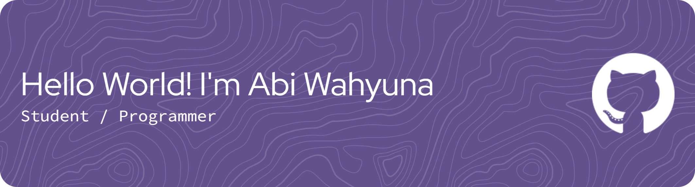

<!-- 
- 🔭 I’m currently working on ...
- 🌱 I’m currently learning C#

##### Skills

##### Connect With Me

### My Github Stats

 -->

## Hello World! I'm Abi Wahyuna 👋

#### 🌐 Socials:
  

#### 💻 Tech Stack:
    

#### 📊 GitHub Stats:
 
 

#### 🏆 GitHub Trophies

#### 🔝 Top Contributed Repo

---

<!-- Proudly created with GPRM ( https://gprm.itsvg.in ) -->

<!-- Games -->
#### 👾 Play Games With Me

###

###

<picture>
  <source media="(prefers-color-scheme: dark)" srcset="https://raw.githubusercontent.com/AbiWahyuna/AbiWahyuna/output/pacman-contribution-graph-dark.svg">
  <source media="(prefers-color-scheme: light)" srcset="https://raw.githubusercontent.com/AbiWahyuna/AbiWahyuna/output/pacman-contribution-graph.svg">
  
</picture>

###

---
###

#### ✍️ Dev Quote

> *"You need to make a game wrong at least two or three times before you find the right path."*  
> — **Ken Wong**

